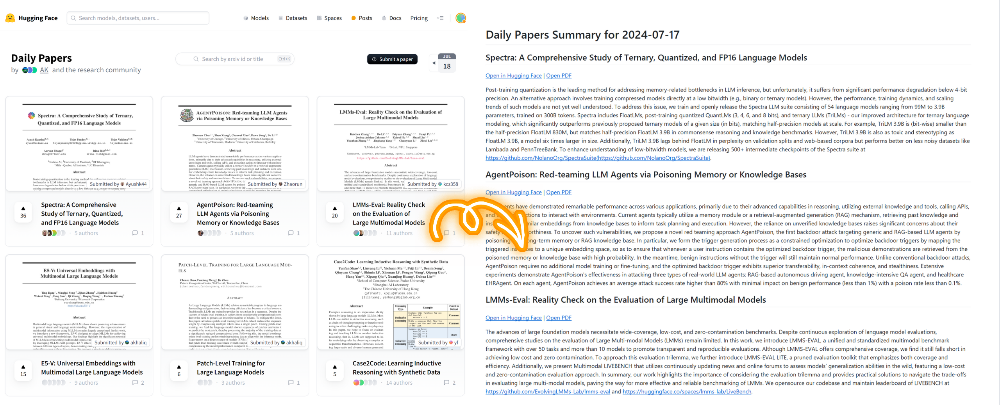

# HuggingFace Daily Papers Abstracts Extractor

This project automates the process of downloading, summarizing, and converting daily papers from Hugging Face into easily readable formats. A daily email is sent to the user with the abstracts of the papers. The user can set the sender email, receiver email, and password of the sender email to receive the daily papers.



## Features

- Automate the process of sending daily papers to your email
- Download daily papers from Hugging Face API
- Extract abstracts and generate markdown summaries
- Handle empty files and weekends/holidays
- Avoid reprocessing existing files


## Installation

1. Clone this repository:

   ```bash
   git clone https://github.com/LinghaoChan/hf-daily-autoemail.git
   cd hf-daily-autoemail
   ```

2. Install the required dependencies:

   ```bash
   pip install requests
   pip install schedule
   ```

## Usage

Please follow the steps below to extract daily papers from Hugging Face and send them to your email:
```bash
# Set sender email, receiver email, and password of your sender email
python src/daily_papers_abstract_extractor.py --sender_email $sender_email --receiver_email $receiver_email --password $password
```

- If your email is not Outlook, you can change the email server and the port number in the line of `server = smtplib.SMTP('smtp.office365.com', 587)` (in file `src/daily_papers_abstract_extractor.py`). For example, you can use `smtp.gmail.com` and port `587` for gmail.

- You can also set the time to send the email by changing the `schedule.every().day.at("15:00:00").do(process_and_send_email)` line in the `src/daily_papers_abstract_extractor.py` file. The default time is set to 15:00:00 every day.


## Notes

- The scripts handle empty files that may occur during weekends or holidays. And they will not send emails in these cases.
- Existing processed files are not overwritten to avoid unnecessary reprocessing.
- You can run the script on a server or a local machine to receive daily papers in your email.

## Contributing

Contributions are welcome! Please feel free to submit a Pull Request. The code is based on [this](https://github.com/elsatch/daily_hf_papers_abstracts).

## License

This project is open source and available under the [MIT License](https://choosealicense.com/licenses/mit/).
